# Sistema Distribuido de Gestión de Turnos

---

# 1. DESCRIPCIÓN GENERAL DEL SISTEMA

## Propósito del sistema

El sistema tiene como propósito gestionar turnos mediante una arquitectura distribuida basada en microservicios. La aplicación permite registrar usuarios, generar turnos, enviar notificaciones y almacenar eventos del sistema.

El proyecto fue desarrollado utilizando Python, Flask, Docker y Docker Compose.

---

## Problemática que resuelve

En muchos bancos la asignación de turnos se realiza manualmente o mediante sistemas centralizados que generan:

- Duplicidad de turnos
- Falta de trazabilidad
- Poca tolerancia a fallos
- Problemas de escalabilidad
- Lentitud en atención
- Ausencia de monitoreo

El sistema distribuido implementado resuelve estos problemas mediante separación de responsabilidades y comunicación entre servicios.

---

## Funcionalidades principales

El sistema permite:

- Registrar usuarios
- Generar turnos
- Validar duplicidad de turnos
- Validar que en el campo del nombre solo sean letras
- Validar que en el campo de teléfono sólo sean números y máximo 10 caracteres
- Validar información del usuario
- Enviar notificaciones
- Registrar historial de eventos
- Monitorear servicios
- Realizar health checks
- Aplicar circuit breaker
- Manejar errores
- Administrar microservicios mediante Docker

---

## Usuarios del sistema

Los usuarios principales son:

- Clientes del banco
- Personal administrativo
- Administradores del sistema

---

## Alcance actual del proyecto

Actualmente el sistema implementa:

- Arquitectura distribuida
- API Gateway
- 5 microservicios
- Comunicación HTTP
- Monitoreo básico
- Tolerancia a fallos
- Circuit breaker
- Persistencia mediante Docker Volumes
- Contenedores Docker
- Logs funcionales

---

# 2. ARQUITECTURA FINAL DEL SISTEMA

## Microservicios implementados

| Servicio       | Puerto | Responsabilidad            |
| --------       | ------ | ---------------            |
| Gateway        | 5000   | Punto de entrada principal |
| Usuarios       | 5001   | Gestión de usuarios        |
| Turnos         | 5002   | Gestión de turnos          |
| Notificaciones | 5003   | Simulación de envío SMS    |
| Historial      | 5004   | Registro de eventos        |
| MySQL          | 3306   | Base de datos              |

---

## Arquitectura general
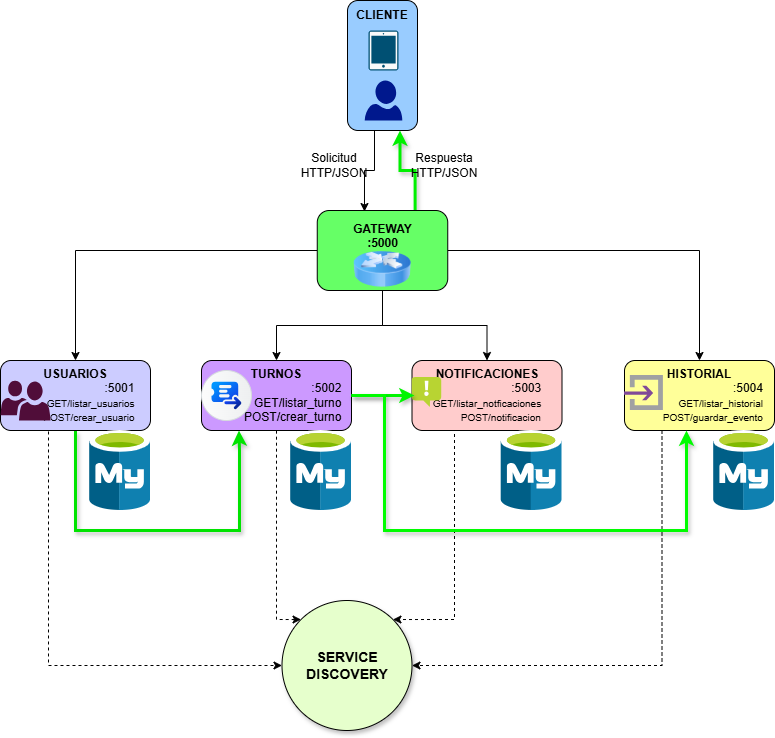
---

## Comunicación entre servicios

La comunicación se realiza mediante HTTP usando la librería requests.

Ejemplos:

```python
requests.post(
    "http://notificaciones:5003/notificacion"
)
```

```python
requests.post(
    "http://historial:5004/guardar_evento"
)
```

---

## Flujo de peticiones

### Registro de usuario

```
Cliente → Gateway → Usuarios
```

### Generación de turno

```
Cliente → Gateway → Turnos
```

### Envío de notificación

```
Turnos → Notificaciones
```

### Registro historial

```
Turnos → Historial
```

---

# 3. JUSTIFICACIÓN DE ARQUITECTURA

## ¿Por qué se dividió en microservicios?

La arquitectura fue dividida para desacoplar responsabilidades y facilitar:

- Escalabilidad
- Mantenimiento
- Monitoreo
- Tolerancia a fallos
- Administración independiente

Cada servicio cumple una función específica.

---

## Responsabilidades de cada servicio

### Gateway

Centraliza las peticiones y actúa como punto de acceso.

### Usuarios

Gestiona registro y consulta de usuarios.

### Turnos

Gestiona la lógica principal de turnos.

### Notificaciones

Simula el envío de SMS.

### Historial

Registra eventos y trazabilidad.

---

## Ventajas obtenidas

- Mejor organización
- Desacoplamiento
- Facilidad de mantenimiento
- Tolerancia a fallos
- Monitoreo individual
- Escalabilidad independiente

---

## Dificultades encontradas

- Comunicación entre contenedores
- Manejo de errores HTTP
- Sincronización de servicios
- Configuración Docker
- Implementación del circuit breaker

---

# 4. TOLERANCIA A FALLOS

## Manejo de errores

Todos los servicios implementan try/except.

Ejemplo:

```python
except Exception as e:

    errores += 1

    return jsonify({
        "error": str(e)
    }), 500
```

---

## Circuit Breaker

El servicio turnos implementa:

- CLOSED
- OPEN
- HALF-OPEN

Cuando el servicio de notificaciones falla múltiples veces:

```
[CIRCUIT BREAKER] OPEN
```

El sistema bloquea temporalmente solicitudes.

Posteriormente entra en:

```
[CIRCUIT BREAKER] HALF-OPEN
```

Si el servicio se recupera:

```
[CIRCUIT BREAKER] CLOSED
```

---

## Recuperación de servicios

Se implementó recuperación básica usando HALF-OPEN.

---

## Validación de disponibilidad

Todos los servicios poseen:

```
/health
```

Ejemplo:

```json
{
  "status": "ok",
  "service": "turnos"
}
```

---

## Logs

Cada servicio imprime logs descriptivos.

Ejemplo:

```
[TURNOS] Turno generado
```

```
[ERROR NOTIFICACIONES]
```

```
[MONITOREO] Tiempo respuesta
```

---

## Monitoreo básico

Cada microservicio incluye:

- Contador de peticiones
- Contador de errores
- Métricas
- Health checks
- Latencia

Endpoint:

```
/metricas
```

---

# 5. SEGURIDAD BÁSICA

---

## Variables de entorno

Se utilizaron variables de entorno mediante:

```
.env
```

Ejemplo:

```
MYSQL_ROOT_PASSWORD=
MYSQL_DATABASE=
MYSQL_USER=
MYSQL_PASSWORD=
```

---

## Archivo .env.example

El repositorio incluye:

```
.env.example
```

sin credenciales reales.

---

# 6. IMPLEMENTACIÓN TÉCNICA

## Tecnologías utilizadas

| Tecnología     | Uso                |
| ---            | ---                |
| Python         | Lenguaje principal |
| Flask          | Microservicios     |
| Docker         | Contenerización    |
| Docker Compose | Orquestación       |
| MySQL          | Base de datos      |
| Requests       | Comunicación HTTP  |

---

## Estructura del proyecto

```
/gestor_turnos

/gateway
/usuarios
/turnos
/notificaciones
/historial
/evidencias

.env
.env.example

docker-compose.yml

```
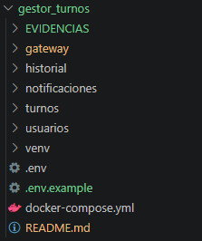

---

## Docker Compose

El sistema utiliza Docker Compose para:

- Levantar contenedores
- Administrar servicios
- Conectar microservicios
- Administrar redes
- Manejar volúmenes

---

# 8. ENDPOINTS PRINCIPALES

## Gateway

| Método | Endpoint         |
| ---    | ---              |
| GET    | /health          |
| GET    | /metricas        |
| POST   | /usuario         |
| GET    | /usuarios        |
| POST   | /turno           | 
| GET    | /turnos          |
| GET    | /historial       |
| POST   | /notificacion    |

---

## Usuarios

| Método | Endpoint           |
| ---    | ---                |
| POST   | /crear_usuario     |
| GET    | /listar_usuarios   |
| GET    | /health            |
| GET    | /metricas          |

---

## Turnos

| Método | Endpoint       |
| ---    | ---            |
| POST   | /crear_turno   |
| GET    | /listar_turnos |
| GET    | /health        |
| GET    | /metricas      |

---

## Notificaciones

| Método | Endpoint               |
| ---    | ---                    |
| POST   | /notificacion          |
| GET    | /listar_notificaciones |
| GET    | /health                |
| GET    | /metricas              |

---

## Historial

| Método | Endpoint          |
| ---    | ---               |
| POST   | /guardar_evento   |
| GET    | /listar_historial |
| GET    | /health           |
| GET    | /metricas         |

---

# 9. COMANDOS IMPORTANTES

## Construir contenedores y levantar servicios

```bash
docker compose up --build
```

---

## Ver logs

---

```bash
docker compose logs -f
```

---

## Ver contenedores

```bash
docker ps
```

---

# REPOSITORIO GITHUB

https://github.com/StefannyCampo95/KenyQuinonez.git


# DOCUMENTO TÉCNICOs

https://www.notion.so/Proyecto-Final-36c76c82496e80f1af07f5e4b3c34940?source=

# LINK DIAPOSITIVAS

https://canva.link/9r9oco5m3owo2w4


# EVIDENCIAS DEL FUNCIONAMIENTO DEL SISTEMA CON POSTMAN

1. Crear Usuario

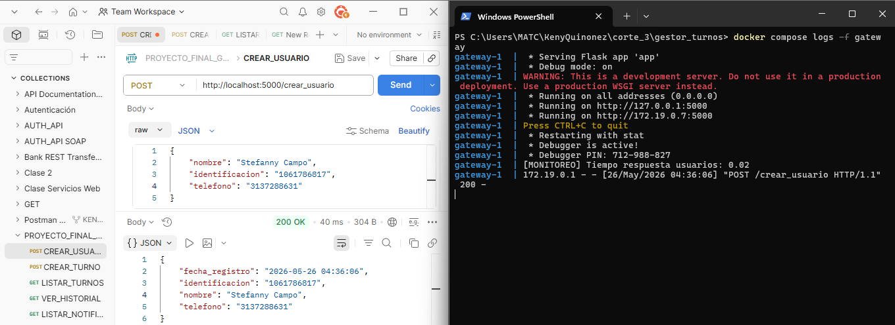
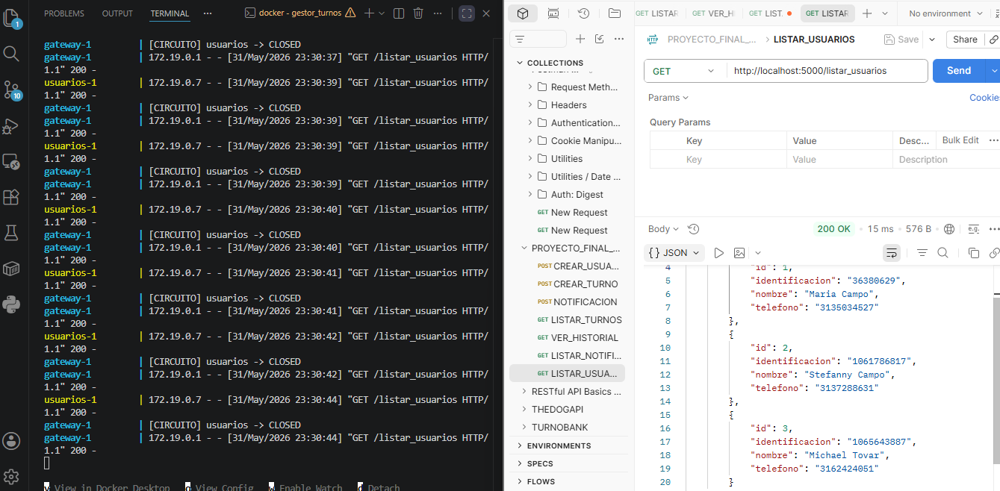


2. Crear Turno

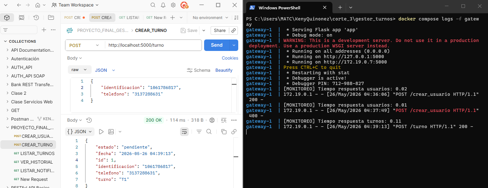
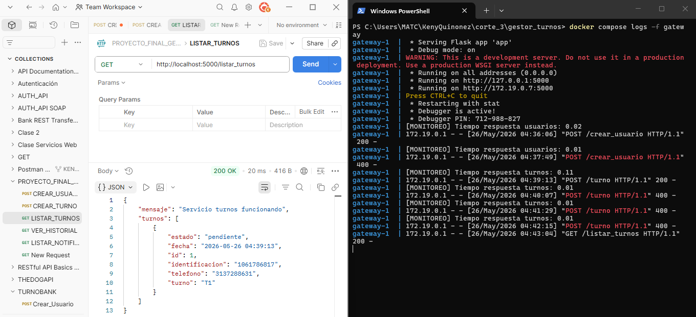

3. Notificación

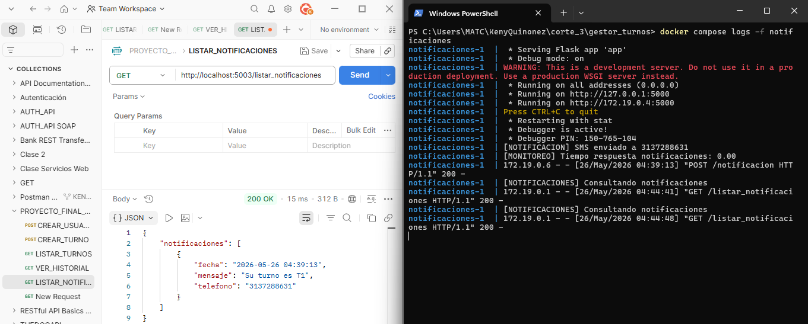

4. Historial 

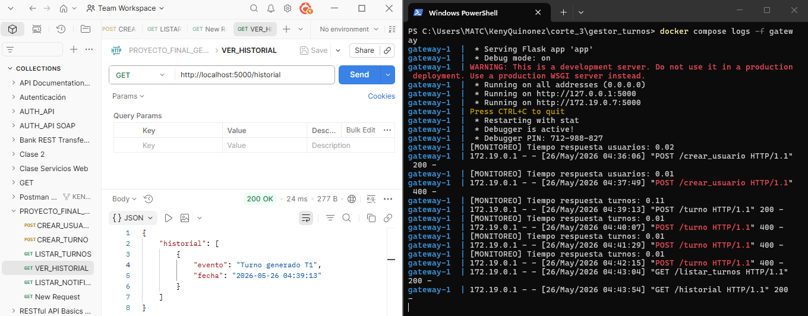

# PRUEBAS

- Error de duplicado de usuario

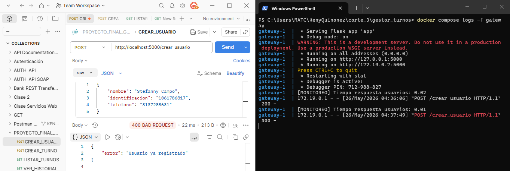
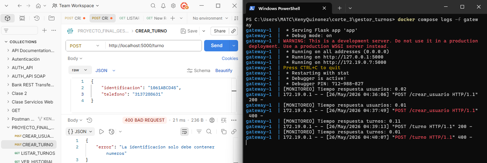
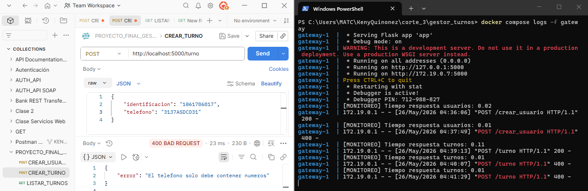

- Simulación de servicios detenidos

Usuarios
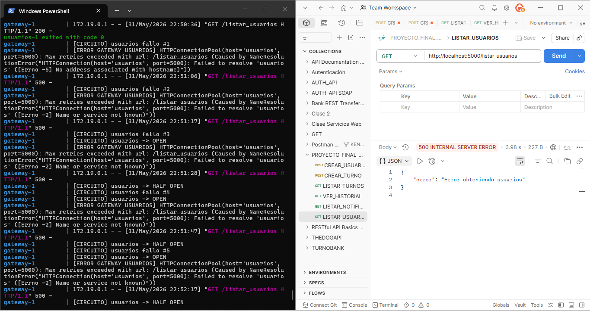

Turnos
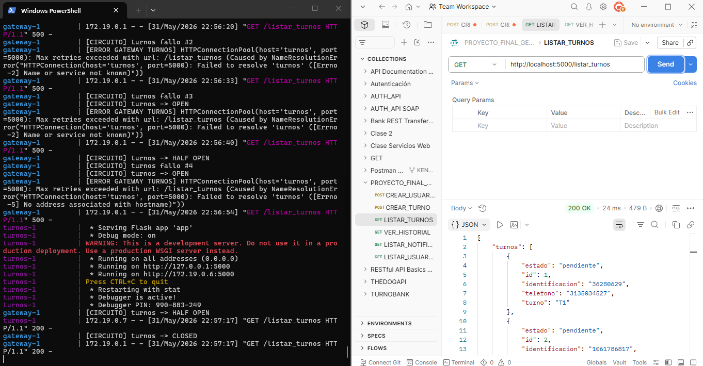

Notificaciones
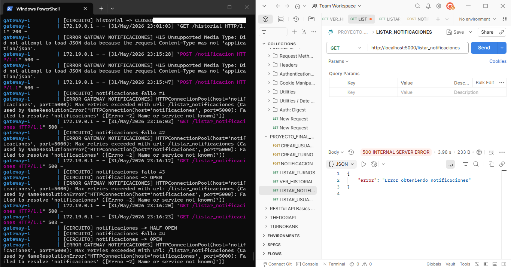

Historial
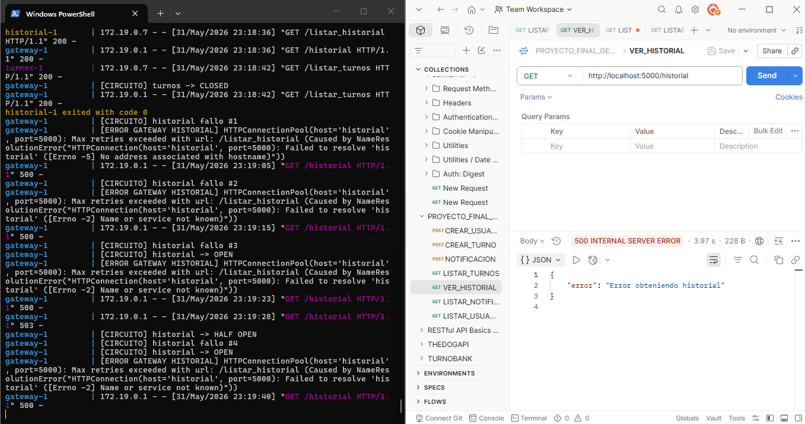