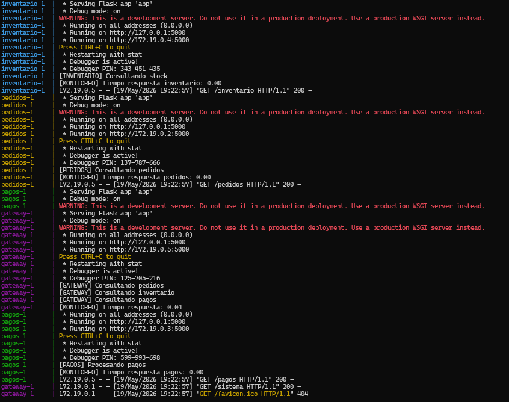
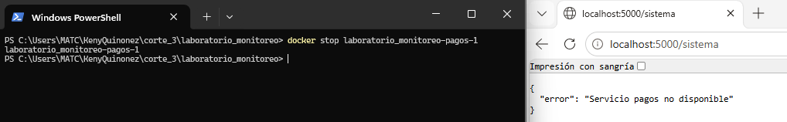
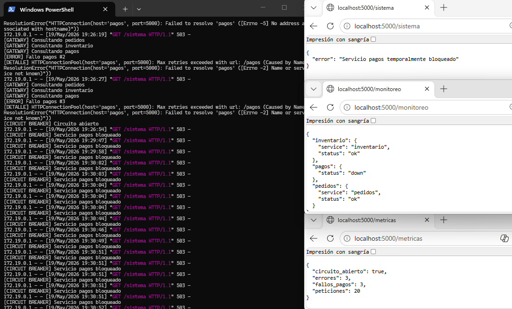

# Introducción

Este laboratorio tiene como objetivo implementar monitoreo básico en un sistema distribuido compuesto por múltiples microservicios.  

Se desarrolló un sistema de pedidos utilizando Flask y Docker Compose, implementando logs, health checks, monitoreo centralizado, simulación de fallos y métricas básicas para analizar el comportamiento del sistema ante errores.

# Arquitectura del Sistema

El sistema está compuesto por 5 microservicios:

Gateway - Punto central de acceso - 5000

Pedidos - Procesamiento de pedidos - 5001

Inventario - Consulta de inventario - 5002 

Pagos - Procesamiento de pagos - 5003 

La arquitectura funciona de la siguiente manera:

Cliente → Gateway → Microservicios

# Tecnologías Utilizadas

Python
Flask
Docker
Docker Compose

# Estructura del Proyecto

─ pedidos ─ inventario ─ pagos ─ monitor ─ gateway ─ docker-compose.yml

1. **CARGAMOS TODOS LOS SERVICIOS EN DOCKER COMPOSE**
    docker-compose up --build

2. **PROBAMOS QUE EL SISTEMA ESTÉ FUNCIONANDO**
    http://127.0.0.1:5000/sistema

    

3. **PROBAMOS - HEALTH CHECKS**

    GATEWAY
    http://localhost:5000/health

    

    PEDIDOS
    http://localhost:5001/health
    
    

    INVENTARIO
    http://localhost:5002/health

    

    PAGOS
    http://localhost:5003/health

    

4. **PROBAMOS - MONITOREO**

    http://localhost:5000/monitoreo

    

5. **PROBAMOS - MÉTRICAS**

    http://localhost:5000/metricas

    

6. **LOGS DE LOS SERVICIOS**
    Abrimos una consola Power Shell y ejecutamos:
    docker compose logs

    

    

    

    

7. **SIMULACIÓN DE FALLOS**
    Apagamos el servicio de pagos con:
    docker stop laboratorio_monitoreo-pagos-1

    

    Ejecutamos:
    docker logs -f laboratorio_monitoreo-gateway-1

    

