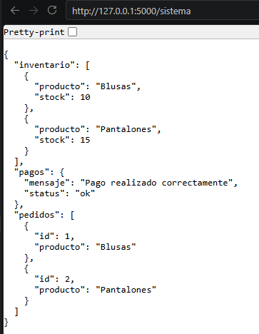
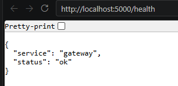
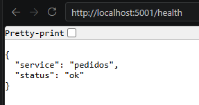
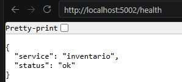
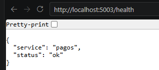
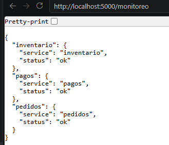
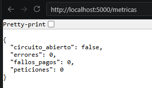
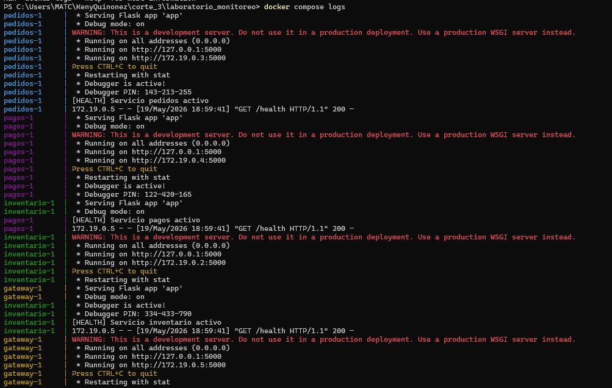
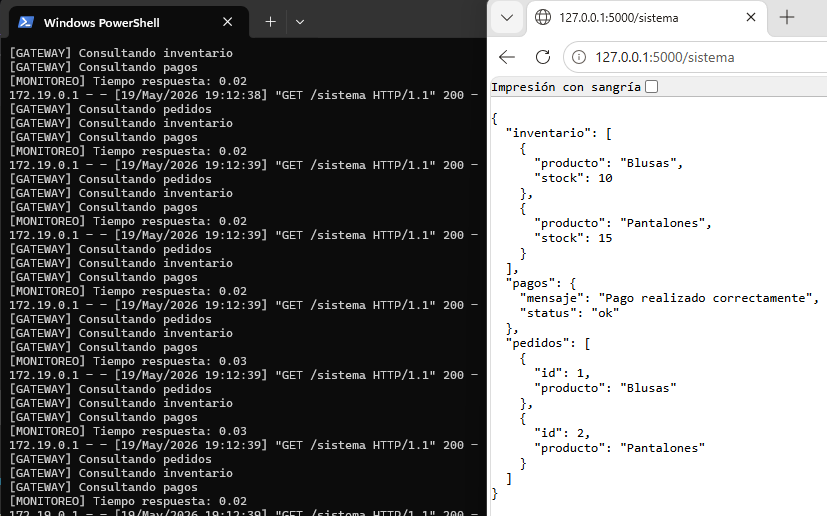
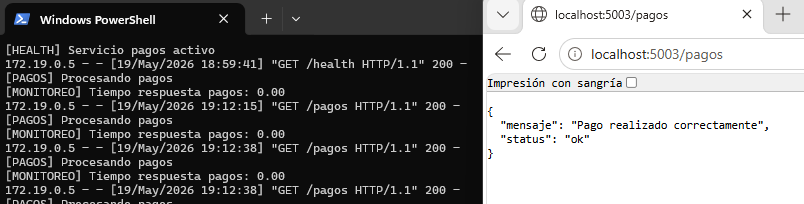

1. **CARGAMOS TODOS LOS SERVICIOS EN DOCKER COMPOSE**
    docker-compose up --build

2. **PROBAMOS QUE EL SISTEMA ESTÉ FUNCIONANDO**
    http://127.0.0.1:5000/sistema

    

3. **PROBAMOS - HEALTH CHECKS**

    GATEWAY
    http://localhost:5000/health

    

    PEDIDOS
    http://localhost:5001/health
    
    

    INVENTARIO
    http://localhost:5002/health

    

    PAGOS
    http://localhost:5003/health

    

4. **PROBAMOS - MONITOREO**

    http://localhost:5000/monitoreo

    

5. **PROBAMOS - MÉTRICAS**

    http://localhost:5000/metricas

    

6. **LOGS DE LOS SERVICIOS**
    Abrimos una consola Power Shell y ejecutamos:
    docker compose logs

    

    

    

